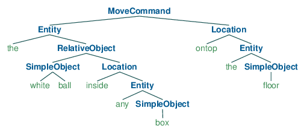
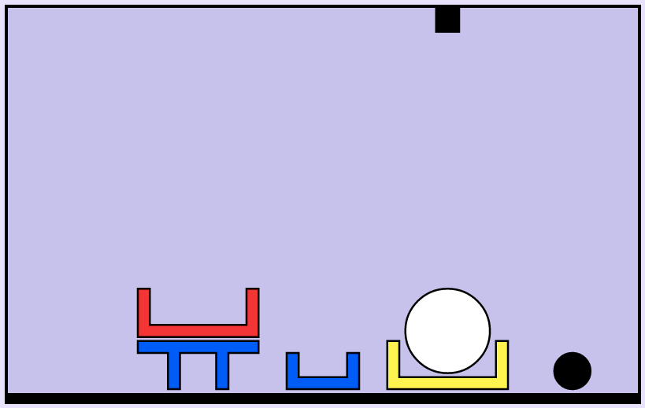

{:.noborder}
<https://img.memesuper.com/7ad355dacca363617cdfcff7defc07ed_-of-morpheus-offering-the-morpheus-pill-meme_520-412.jpeg>
{:.tiny}
---

# Last time...

_"Mary saw the man with a telescope"_

{:.noborder}
{:.noborder}

Notes:

- Phrase structure
- Grammars
- Parsing

---

_"Colourless green ideas sleep furiously"_

{:.noborder}

<http://wmjasco.blogspot.se/2008/11/colorless-green-ideas-do-not-sleep.html>
{: .tiny}

{:.fragment}
✋ Is this sentence valid?
<span style="background:lime;color:white;padding:3px 6px;">Yes</span> or
<span style="background:magenta;color:white;padding:3px 6px;">No</span>

---

# Why syntax?

{:.noborder}

Notes:

- We've talked a lot about trees, but what do we do with them?
- The trees themselves are not the goals

---

## Semantic representation

Introducing logical terms

- _Mary_ = `Mary`
- _the man_ = `Man`
- _Mary saw the man_ = `Saw(Mary, Man)`

---

### Semantic interpretation (1)

{:.noborder}  
↓

`With(Saw(Mary, Man), Telescope)`

---

### Semantic interpretation (2)

{:.noborder}  
↓

`Saw(Mary, With(Man, Telescope))`

---

# Compositional semantics

- _Mary_ = `Mary`
- _the man_ = `Man`
- _Mary saw the man_ = `Saw(Mary, Man)`
- {:.fragment} _saw_ = `λy λx · Saw(x, y)`
- {:.fragment} _saw the man_ = `λx · Saw(x, Man)`

Notes:

- Draw on board

---

# Interpretation

_syntactic_ representation → _semantic_ representation

parse tree → logical term

---

Utterance: _"move the white ball into the red box"_  
{:.noborder}  
✋ Is this ambiguous?
<span style="background:lime;color:white;padding:3px 6px;">Yes</span> or
<span style="background:magenta;color:white;padding:3px 6px;">No</span>

---

Goal: `inside(white_ball, red_box)`  
{:.noborder}

---

Utterance: _"move the ball into the red box"_  
{:.noborder}  
✋ Is this ambiguous?
<span style="background:lime;color:white;padding:3px 6px;">Yes</span> or
<span style="background:magenta;color:white;padding:3px 6px;">No</span>

Notes:

The ambiguity is not syntactic!

---

# Shrdlite pipeline

1. _Parsing_: `text input → parse trees`
1. _Interpretation_: `parse tree + world → goals`
1. _Ambiguity resolution_: `many goals → one goal`
1. _Planning_: `goal → robot movements`
{: .list}

---

# Parsing

`text input → parse trees`

```function parse(input:string) : string | ShrdliteResult[]
```
{: .code}

```interface ShrdliteResult {
    input : string
    parse : Command
    interpretation? : DNFFormula
    plan? : string[]
}
```
{: .code}

---

# Grammar (simplified)

From file `Grammar.ne`

```command   -->  "put"       entity  location
entity    -->  quantifier  object
object    -->  size:?      color:?   form
object    -->  object      location
location  -->  relation    entity
```
{: .code}

Notes:

- Recursion
- Draw a tree top-down on the board

---

_“put the white ball in a box on the floor”_  
{:.noborder}  
✋ Is this ambiguous?
<span style="background:lime;color:white;padding:3px 6px;">Yes</span> or
<span style="background:magenta;color:white;padding:3px 6px;">No</span>  

---

_“put the white ball in a box on the floor”_  
{:.noborder}  
✋ Is the ambiguity
<span style="background:lime;color:white;padding:3px 6px;">syntactic</span> or
<span style="background:magenta;color:white;padding:3px 6px;">semantic</span>?

Notes:

It is both syntactically **and** semantically ambiguous

---

## Parse 1

_"put the white ball **that is** in a box on the floor"_

{:.noborder}


Notes:

- Show optional "that is" in grammar.

---

## Parse 2

_"put the white ball in a box **that is** on the floor"_

{:.noborder}

---

# Interpretation

`parse tree + world → goals`

```function interpretCommand(
    cmd: Command,
    state: WorldState
  ): DNFFormula
```
{: .code}

---

# Logical interpretations ("Goals")

```type DNFFormula = Conjunction[]
type Conjunction = Literal[]
```
{: .code}

DNF = Disjunctive Normal Form

Example: `(x ∧ y) ∨ (z)`

```DNFFormula([Conjunction([x, y]), Conjunction(z)])
```
{: .code}

---

# Literals

```interface Literal {
  relation : string;
  args : string[];
  polarity : boolean;
}
```
{: .code}

Example: `ontop(a,b)`

```{ relation:"ontop", args:["a","b"], polarity:true }
```
{: .code}

---

# Spatial relations

- x is **on top** of y if it is directly on top
- x is **above** y if it is somewhere above
- ...
{: .list}

---

# Ambiguity

- DNF inherently captures ambiguity
- **But** impossible interperetations should be removed

---

_"put the white ball **that is** in a box on the floor"_  
{:.noborder}  
There is no <strike>spoon</strike> _white ball in a box_.

Notes:

- Thus we eliminate the syntactic ambiguity and end up with just one parse tree to interpret.

---

_"put the white ball in a box on the floor"_
{:.noborder}

---

`inside(WhiteBall, YellowBox)`  
Yellow box is already on floor: 3 moves
{:.noborder}

---

`inside(WhiteBall, RedBox) ∧ on(RedBox, floor)`  
Red box can be placed on floor first: 2 moves
{:.noborder}

---

# Final interpretation

`inside(WhiteBall, YellowBox) ∨ (inside(WhiteBall, RedBox) ∧ on(RedBox, floor))`

---

# Physical laws

- Balls must be in boxes or on the floor, otherwise they roll away.
- Small objects cannot support large objects.
- ...
{: .list}

---

# Interpreter test cases

- Each test case contains a _list of interpretations_
- Each interpretation is already a list (a disunction of conjunctions)

```{
  world: "small",
  utterance: "take a blue object",
  interpretations: [["holding(BlueTable)","holding(BlueBox)"]]
}
```
{:.code}

```{
  world: "small",
  utterance: "put a black ball in a box on the floor",
  interpretations: [["inside(BlackBall,YellowBox)"],
                    ["ontop(BlackBall,floor)"]]
}
```
{:.code}

---

## Conjunction

```{
  world: "small",
  utterance: "put all balls on the floor",
  interpretations: [["ontop(WhiteBall,floor) & ontop(BlackBall,floor)"]]
}
```
{:.code}

---

## No valid interpretations

```{
  world: "small",
  utterance: "put a ball on a table",
  interpretations: []
}
```
{:.code}

Breaks the laws of nature!

---

## Some interpretations are missing

```{
  world: "small",
  utterance: "put a ball in a box on the floor",
  interpretations: [["COME UP WITH YOUR OWN INTERPRETATION"]]
}
```
{:.code}

---

# Tips for interpreter in Shrdlite

- Sub-functions based on grammar types
- Use `instanceof` when traversing parse tree (`Command`)
- Use recursion to handle nesting  
  _"put a box in a box on a table on the floor"_
{:.list}

Notes:

- Show that `Command` can be various sub-types

---

# Ambiguity resolution

Handling multiple interpretations

- Fail
- Pick "first"
- Use some rules of thumb  
  _e.g. prefer box already on floor_
- Ask the user for clarification (extension)
{:.list}

---

# Planning

`goal → robot movements`

- Movements: _left, right, pick, drop_
- Use graph search
- Given a disjunction of goals, should find the easiest to satisfy
{:.list}

---

## Audience participation meta-question

✋ Do you prefer
<span style="background:lime;color:white;padding:3px 6px;">Socrative</span> or
<span style="background:magenta;color:white;padding:3px 6px;">post-it notes</span>?

_Thank you for returning your post-it notes! 🦄_
{: style="margin-top:50px"}
